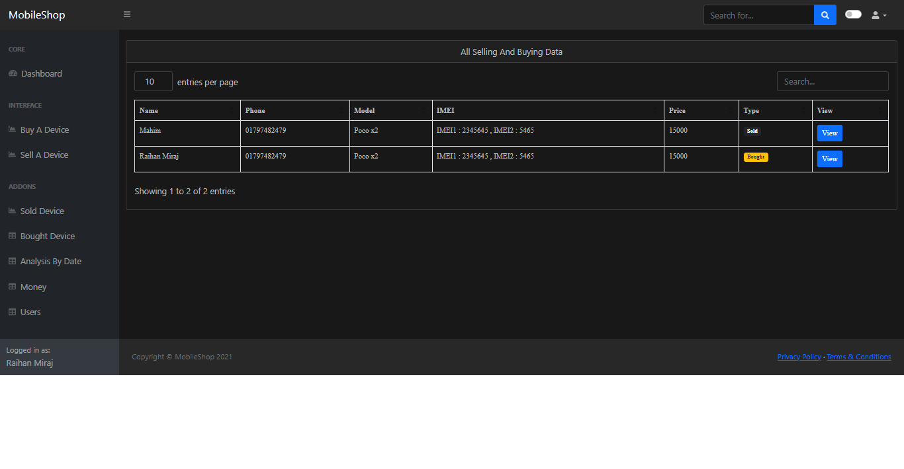
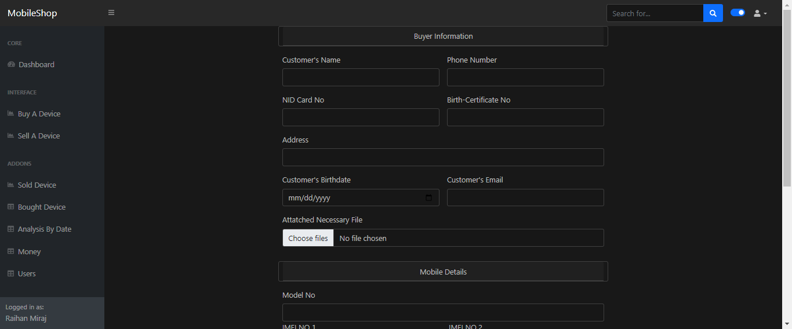
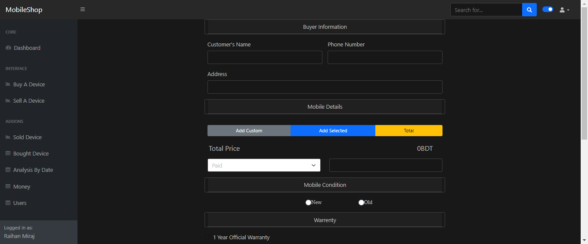
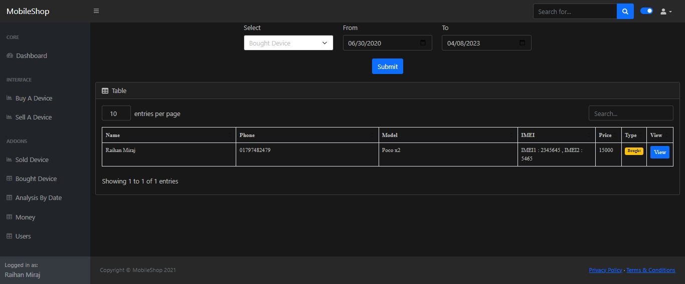
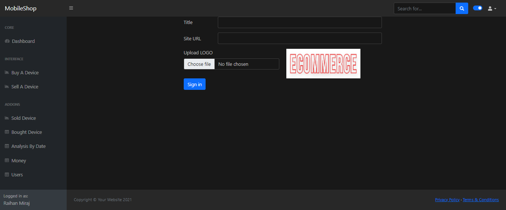
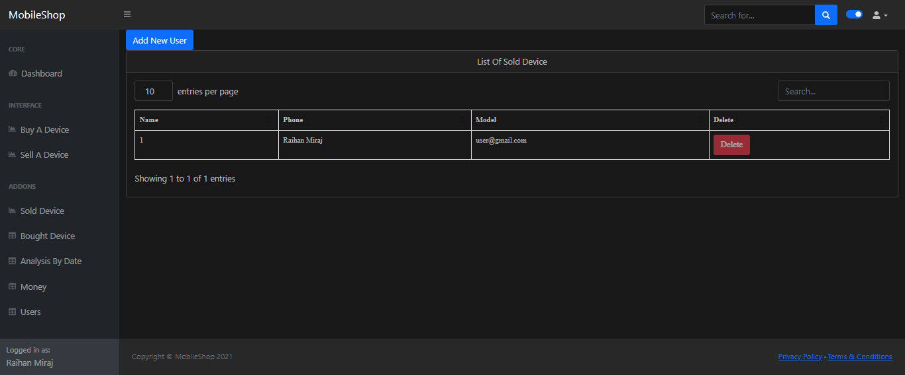

# Second Hand Mobile Shop

A second-hand mobile app is a platform for buying and selling used mobile phones. It has a simple user interface where users can search for specific phone models

## Installation

Just clone this  and run on a apache server

## Features

- sellers can create and manage their listings of used mobile phones
- communication platform for sellers to communicate with potential buyers and respond to queries
- analytics and reporting features to help them track their sales and understand their business performance
 

 

## Screenshot

Here Are Some Screenshot/Demo 

## Shop Analytics

## Buy Form 

##  Sell Form

## Bought List

 
## Settings

## User Panel

 